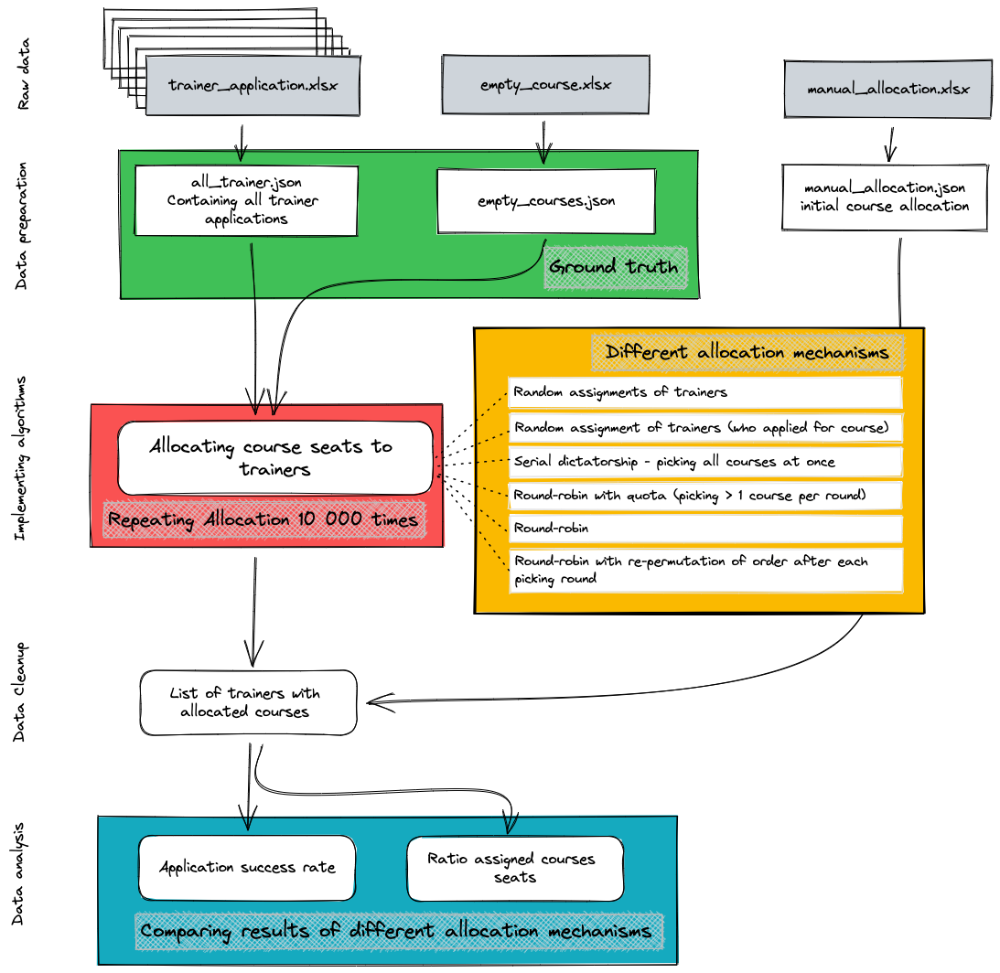

# Empirical Analysis of a many-goods-to-one-agent allocation problem
## The Project in a nutshell:
The aim of this project was to compare empirically the results of different allocation mechanisms that can be applied in many-goods-to-one-agent allocation problems. Therefore, I have implemented six different allocation mechanisms and applied them to real life data from an organization. The problem was the allocation of course seats (goods) to trainers (agents). Based on the specificity of the case, I have chosen two metrics which allowed an assessment of the efficiency of the allocation: (1) the ratio of assigned course seats and (2) the coefficient of variation, which combines the standard deviation as a measurement of fairness between trainers and the mean as a measurement of how many preferred courses seats were allocated per trainer. Each allocation was performed 10 000 times in order to get more observations. 

## Workflow:

## Filestructure:
| Step in Workflow                    | Moduls that cover the step | script that perform the step             |
| ----------------------------------- | -------------------------- | ---------------------------------------- |
| Data preparation / formatting       | M1, M2                     | rawdata_to_GT.py                         |
| Analyzing ground truth              | M3                         | analysis_GT.ipynb                        |
| Implementing allocation mechanisms  | M1, M4                     | implementing_mechanisms_data_cleaning.py |
| Data Cleaning for Analysis          | M1, M2(, M3)               | implementing_mechanisms_data_cleaning.py |
| Data Analysis                       | M3, M4                     | data_analysis.ipynb                      |
| All relevant functions              | M1, M2, M3                 | data_parsing_functions.py                |

 